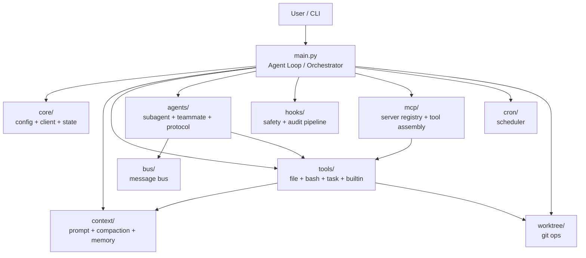

# MiniClawCode

MiniClawCode is a lightweight terminal coding agent project.  
It was built while learning from [shareAI-lab/learn-claude-code](https://github.com/shareAI-lab/learn-claude-code), then extended with a more modular architecture, multi-agent collaboration, task routing, memory management, safety rails, and MCP-style extensibility.

## Project Description

This project is not only a simple command-line agent clone. It is also a learning and engineering exercise focused on turning a coding agent into a clearer, more extensible system.

Key goals:

- modular Python package layout
- role-based teammates
- task planning, claiming, completion, and requeue flow
- lightweight long-term memory with maintenance tools
- safety checks and audit logs
- MCP-style tool expansion with configurable local adapters

## Project Origin

Yes, it is a good idea to explicitly mention the learning source.  
This project is clearly inspired by [shareAI-lab/learn-claude-code](https://github.com/shareAI-lab/learn-claude-code), and that context helps readers understand both the motivation and the evolution of this repository.

Compared with the original learning project, this version focuses more on:

- modularization
- multi-agent task flow
- runtime observability
- execution safety
- configurable MCP extensions

## Core Capabilities

- interactive terminal coding agent
- Anthropic-compatible model/provider access
- todo and structured task management
- teammate spawning with `planner`, `coder`, `reviewer`, `tester`
- stale teammate detection and task requeue
- memory persistence, dedupe, and prune
- built-in and configurable MCP-style tool servers

## Architecture Diagram



## Repository Structure

- `main.py`: top-level orchestrator and CLI loop
- `core/`: runtime config, model client, shared state
- `context/`: prompt assembly, compaction, long-term memory
- `tools/`: file, shell, task, and builtin tools
- `agents/`: subagent, teammate, and protocol logic
- `mcp/`: MCP-style server registry and tool assembly
- `hooks/`: safety and audit pipeline
- `cron/`: scheduled task support
- `worktree/`: git worktree helpers
- `bus/`: teammate message bus
- `models/`: shared schemas

## Quick Start

```bash
pip install -r requirements.txt
python main.py
```

Configure `.env` before launch:

```env
ANTHROPIC_API_KEY=your_key_here
MODEL_ID=deepseek-chat
ANTHROPIC_BASE_URL=https://api.deepseek.com/anthropic
```

A compatibility entrypoint is also kept:

```bash
python code.py
```

## MCP Extension

Built-in demo servers:

- `docs`
- `deploy`

To add your own shell-backed MCP-style server:

```bash
copy .mcp_servers.example.json .mcp_servers.json
```

Then edit `.mcp_servers.json` and restart the app.

## Suggested Demo Flow

1. Start the agent and explain provider/model configurability
2. Show `auto_plan_tasks`
3. Show `spawn_teammate` and `list_teammates`
4. Show `list_tasks` and `requeue_task`
5. Show `list_memory_notes`, `dedupe_memory`, and `prune_memory`
6. Show `connect_mcp`, `list_connected_mcp`, and `list_mcp_tools`

## Current Status

This version is suitable for local demos, continued iteration, and learning-oriented engineering showcase.  
It is not fully production-grade yet, but it already presents a clear architecture and several differentiated capabilities.

## License

MIT
