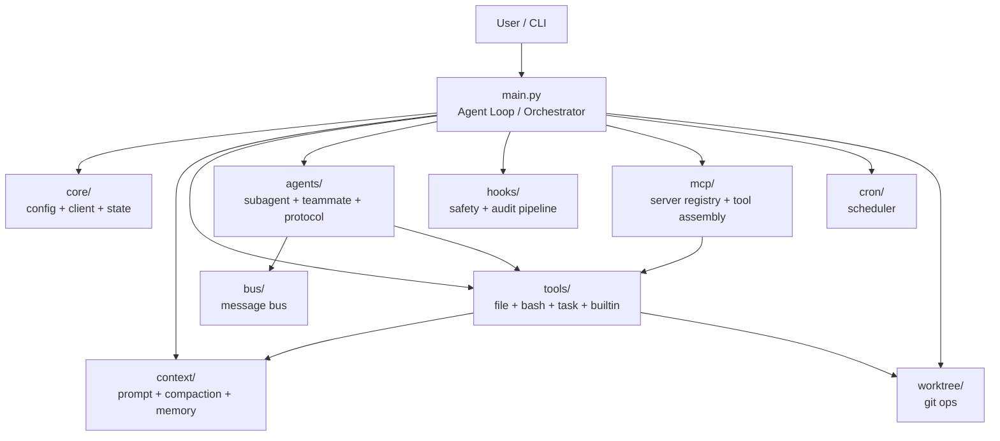

# MiniClawCode

MiniClawCode 是一个面向终端的轻量级 AI Coding Agent 项目。  
它是在学习 [shareAI-lab/learn-claude-code](https://github.com/shareAI-lab/learn-claude-code) 的过程中逐步实现出来的，并在此基础上继续做了模块化拆分、多代理协作、任务调度、长期记忆、安全执行层和 MCP 扩展能力。

## 项目描述

这个项目的目标不是单纯复刻一个命令行代理，而是把一个可运行的 coding agent 拆成清晰的模块，并在学习型项目的基础上做出更明显的差异化能力：

- 模块化 Python 包结构，便于理解和二次开发
- 角色化多代理协作，支持 `planner / coder / reviewer / tester`
- 任务创建、自动拆解、认领、完成、重派
- 长期记忆沉淀、去重和裁剪
- 风险命令确认、路径逃逸保护、审计日志
- MCP 风格工具扩展，支持内置 server 和本地配置式 server

## 项目来源

本项目明确受到了 [shareAI-lab/learn-claude-code](https://github.com/shareAI-lab/learn-claude-code) 的启发。  
README 里提这一点是有必要的，也比较合适，因为这能帮助别人理解项目的学习背景和演进方向。

和原始学习项目相比，这个版本更强调：

- 工程结构模块化
- 多代理和任务闭环
- 状态可观测性
- 安全执行层
- 可配置 MCP 扩展

## 主要能力

- 在终端中作为交互式 coding agent 运行
- 使用 Anthropic-compatible API 接入不同模型提供方
- 管理 `todo` 和结构化任务
- 自动拆解任务并拉起角色化 teammate
- 检测 stale teammate，并自动重派卡住任务
- 保存长期记忆，并支持 `dedupe/prune`
- 连接内置或自定义 MCP 风格工具服务

## 项目架构图



## 目录结构

- `main.py`：主入口与顶层编排
- `core/`：运行时配置、模型客户端、全局状态
- `context/`：上下文构造、压缩、长期记忆
- `tools/`：文件、shell、任务、内置工具
- `agents/`：子代理、teammate、协议流转
- `mcp/`：MCP 风格 server 注册与工具挂载
- `hooks/`：安全执行和审计流水线
- `cron/`：定时任务调度
- `worktree/`：git worktree 管理
- `bus/`：代理间消息总线
- `models/`：共享数据结构

## 快速开始

1. 创建并激活 Python 环境
2. 安装依赖

```bash
pip install -r requirements.txt
```

3. 配置 `.env`

```env
ANTHROPIC_API_KEY=your_key_here
MODEL_ID=deepseek-chat
ANTHROPIC_BASE_URL=https://api.deepseek.com/anthropic
```

4. 启动

```bash
python main.py
```

兼容入口也保留了：

```bash
python code.py
```

## MCP 扩展

内置演示 server：

- `docs`
- `deploy`

如需添加本地配置式 MCP 风格 server：

```bash
copy .mcp_servers.example.json .mcp_servers.json
```

然后编辑 `.mcp_servers.json` 并重启程序。

## 推荐演示路径

如果你想快速展示项目，可以按这条顺序演示：

1. 启动 agent，说明它支持 Anthropic-compatible provider
2. 展示 `auto_plan_tasks`
3. 展示 `spawn_teammate` 和 `list_teammates`
4. 展示 `list_tasks` 与 `requeue_task`
5. 展示 `list_memory_notes`、`dedupe_memory`、`prune_memory`
6. 展示 `connect_mcp`、`list_connected_mcp`、`list_mcp_tools`

## 当前状态

这个版本已经适合本地演示、继续迭代和作为学习型工程展示。  
它还不是完全生产级，但已经具备比较完整的架构、清晰的模块边界和一套有特色的差异化能力。

## License

MIT
